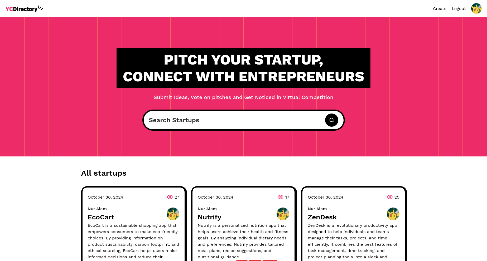

# YC Directory

A modern Full Stack app for the new era for startups. Submit your ideas, vote on pitches and get noticed in virtual competition.
**Pitch, Vote, Grow**



## Live Site

Check out the live site: [YC Directory](https://yc-directory.pages.dev/)

## Features

- Simple and clean UI design
- Github authentication
- Search functionality
- Details page for pitches
- Live content fetching
- Dedicated user profile page
- Live views counting
- Startup submission page

## Tech Stack

- React 19
- Next.js 15
- Tailwind CSS
- Sanity
- Shadcn

## Quick Start

### Prerequisites

Make sure you have the following installed on your local machine

- Git
- Node.js
- npm or yarn

### Installation

1. Clone the repo

```sh
git clone https://github.com/nuralam123/yc-directory.git
cd yc-directory
```

2. Install the project dependencies using npm or yarn

```sh
npm install
# or
yarn install
```

3. Set up Environment variables

```sh
AUTH_SECRET=
AUTH_GITHUB_ID=
AUTH_GITHUB_SECRET=

NEXT_PUBLIC_SANITY_PROJECT_ID=
NEXT_PUBLIC_SANITY_DATASET=
NEXT_PUBLIC_SANITY_API_VERSION='vX'
SANITY_WRITE_TOKEN=

```

Replace the placeholder values with your actual Sanity credentials. You can obtain these credentials by signing up & creating a new project on the [Sanity website.](https://www.sanity.io/)

4. Running the project

```sh
npm run dev
```

Open [http://localhost:3000](http://localhost:3000) in your browser to view the project

## Design

The design and project was showcased by [JavaScript Mastery](https://www.youtube.com/@javascriptmastery). You can find the tutorial here [Next.js 15 Crash Course | Build and Deploy a Production-Ready Full Stack App](https://www.youtube.com/watch?v=Zq5fmkH0T78)

## License

This project is open source and available under the [MIT License](./LICENSE.md)

### Acknowledgements

The design and project was showcased by [JavaScript Mastery](https://www.youtube.com/@javascriptmastery). You can find the tutorial here [Next.js 15 Crash Course | Build and Deploy a Production-Ready Full Stack App](https://www.youtube.com/watch?v=Zq5fmkH0T78)

While the implementation code is licensed under the MIT License, please note that this does not extend to any design assets or other resources provided by JavaScript Mastery. For usage of those elements, please refer to JavaScript Mastery terms and conditions.
